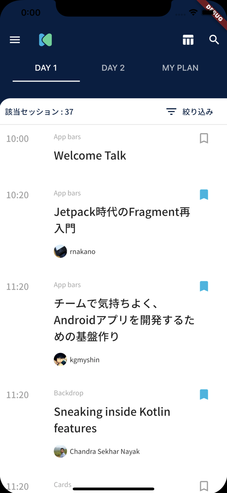
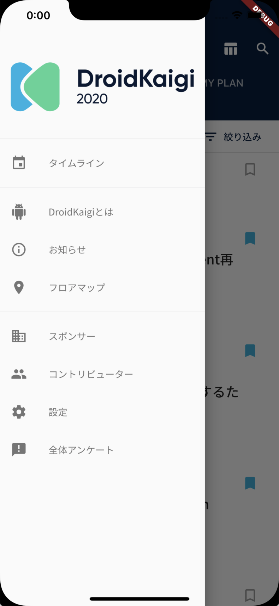
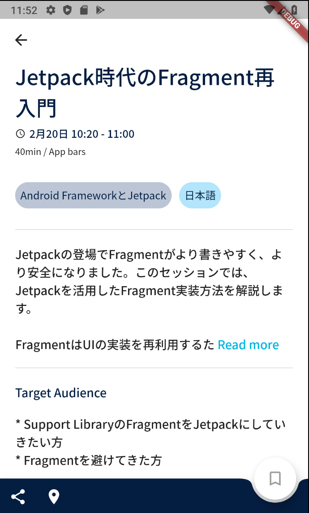
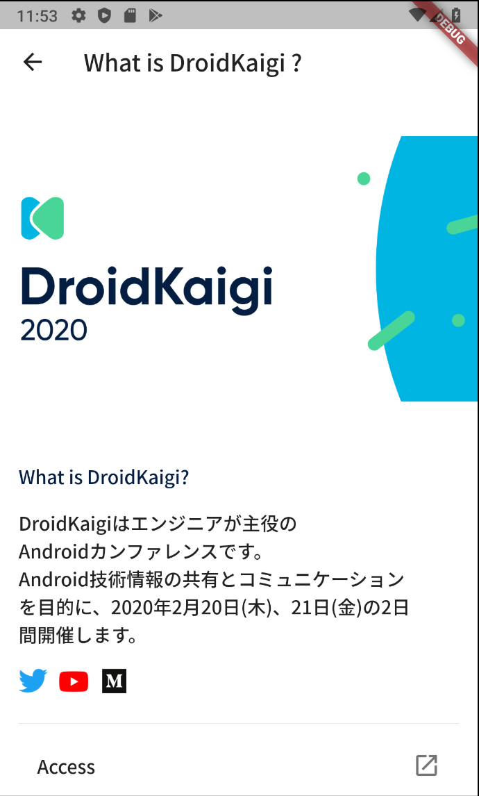
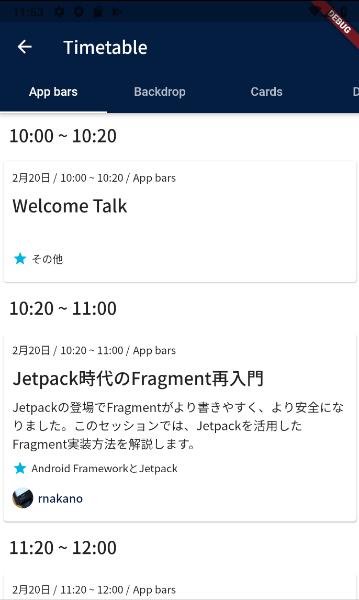
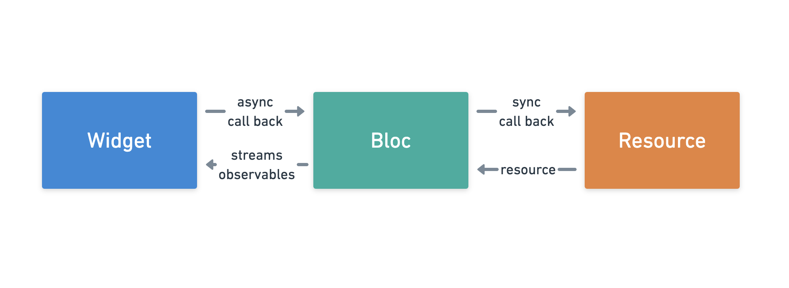
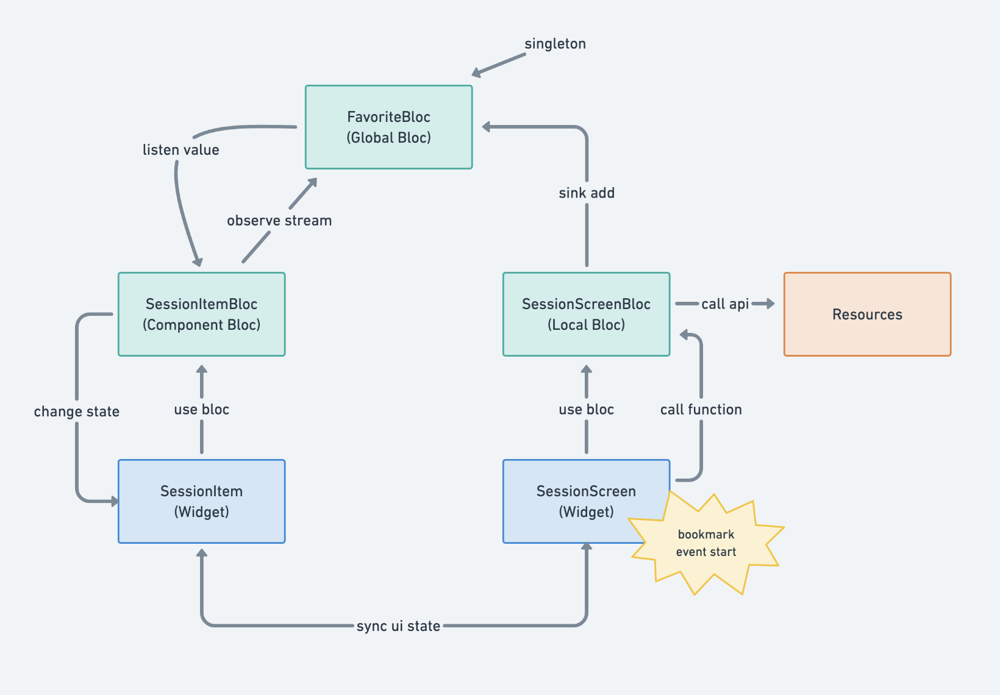
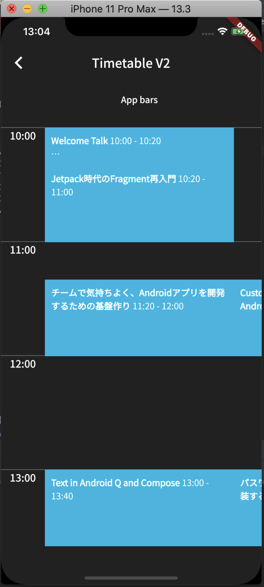

# DroidKaigi 2020 Flutter App 💙

The **unofficial** conference app for DroidKaigi 2020.

[DroidKaigi 2020](https://droidkaigi.jp/2020/) is a conference tailored for developers on 20th and 21st February 2020.

This app is built using Flutter and Firebase for both iOS and Android.

[Here](https://github.com/DroidKaigi/conference-app-2020) is a great official app!

I'm very grateful for the staff, developers, designers and other contributors. :)

# Features

## iOS

     

## Android

     

## Video Recording

  

# Getting Started

1. Install Flutter. See https://flutter.dev/setup/
2. Setting up the IntelliJ. See https://flutter.dev/ide-setup/
3. Fork and clone this repository.
4. Move to unofficial_conference_app_2020 directory.
5. Run flutter run command.

# Contributing

1. Fork it
2. Create your feature branch (git checkout -b new_feature_branch)
3. Commit your changes (git commit -am 'Add some feature')
4. Push to the branch (git push origin new_feature_branch)
5. Create new Pull Request

# Implementation

## Architecture

This Application uses Bloc Pattern based architecture using RxDart, Provider, StreamBuilder, Firebase.



## Sync ui state



## Timetable ui



use package [here](https://github.com/yamarkz/flutter_timetable_view)

# License

```
Copyright 2020 Kazuki Yamaguchi

Licensed under the Apache License, Version 2.0 (the "License");
you may not use this file except in compliance with the License.
You may obtain a copy of the License at

    http://www.apache.org/licenses/LICENSE-2.0

Unless required by applicable law or agreed to in writing, software
distributed under the License is distributed on an "AS IS" BASIS,
WITHOUT WARRANTIES OR CONDITIONS OF ANY KIND, either express or implied.
See the License for the specific language governing permissions and
limitations under the License.
```